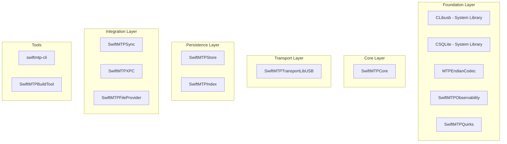
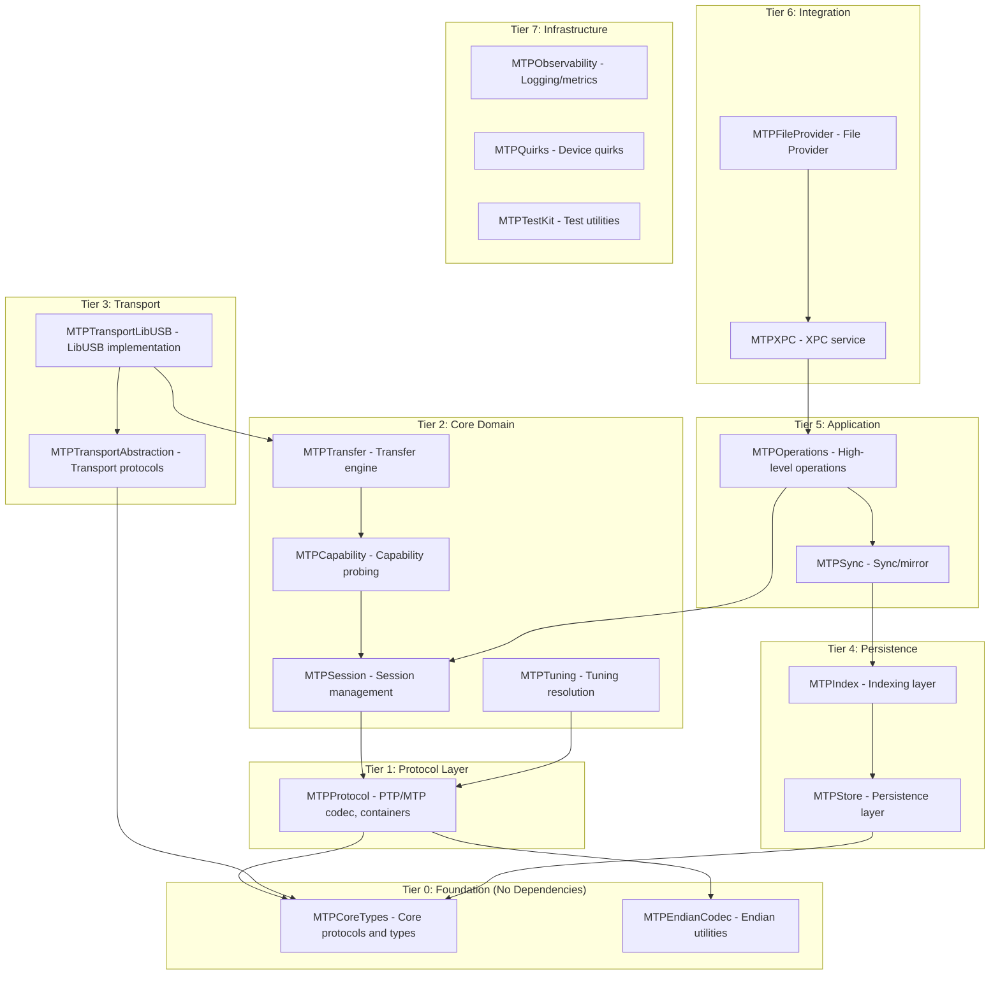
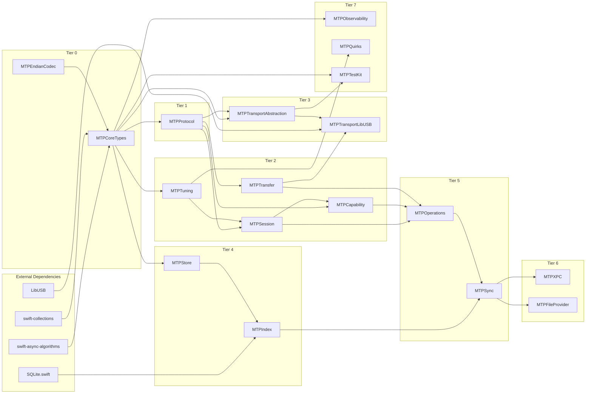
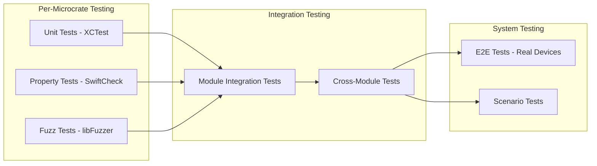

# SwiftMTP Microcrate Architecture

**Document Version:** 1.0  
**Date:** 2026-02-24  
**Status:** Architecture Proposal  

---

## Executive Summary

This document outlines a comprehensive microcrate architecture for SwiftMTP, breaking down the monolithic SwiftMTPKit package into focused, independently testable microcrates. The architecture addresses current SRP (Single Responsibility Principle) violations while maintaining the project's existing functionality and testing infrastructure.

---

## 1. Current State Analysis

### 1.1 Existing Module Structure

The current SwiftMTPKit package consists of 12 library targets and 17 test targets organized in a layered architecture:



### 1.2 Current Module Inventory

| Module | Primary Responsibility | LOC (approx) | Dependencies |
|--------|----------------------|--------------|--------------|
| MTPEndianCodec | Little-endian encoding/decoding for MTP protocol | ~500 | None |
| SwiftMTPObservability | Logging, throughput metrics | ~100 | None |
| SwiftMTPQuirks | Device quirks database, tuning flags | ~400 | None |
| SwiftMTPCore | MTP protocol, device abstraction, CLI types | ~2,500 | Quirks, Observability |
| SwiftMTPTransportLibUSB | USB transport, interface probing | ~1,800 | Core, CLibusb |
| SwiftMTPStore | SwiftData persistence | ~500 | Core |
| SwiftMTPIndex | SQLite index, caching, crawling | ~1,200 | Core, Store, CSQLite |
| SwiftMTPSync | Mirror engine | ~300 | Core, Index |
| SwiftMTPXPC | XPC service protocol | ~400 | Core, Transport, Index |
| SwiftMTPFileProvider | File Provider extension | ~400 | Core, Index, Store, XPC |
| SwiftMTPTestKit | Test utilities | ~400 | Core, Quirks |
| SwiftMTPCLI | CLI utilities | ~300 | Core |

### 1.3 Identified SRP Violations

#### 1.3.1 MTPDeviceActor (Critical)

**Location:** `SwiftMTPCore/Internal/DeviceActor.swift` + `DeviceActor+Transfer.swift`  
**Size:** ~75,000 characters combined

**Responsibilities:**
| Responsibility | Description | Extraction Candidate |
|----------------|-------------|---------------------|
| Session Management | Opening/closing MTP sessions, stabilization | MTPSessionManager |
| Tuning Application | Loading quirks, learned profiles, building effective tuning | TuningResolver |
| Capability Probing | Testing partial read/write, events support | CapabilityProber |
| Transfer Operations | Read/write with progress, journaling, resume | TransferEngine |
| Storage Management | Listing storages, handling empty storage fallback | StorageManager |
| Event Handling | Event pump, event polling | EventPump |
| Quirk Resolution | Fingerprint building, quirk matching | Already in Quirks |

#### 1.3.2 LibUSBTransport (Major)

**Location:** `SwiftMTPTransportLibUSB/LibUSBTransport.swift`  
**Size:** ~56,000 characters

**Responsibilities:**
| Responsibility | Description | Extraction Candidate |
|----------------|-------------|---------------------|
| Device Discovery | Enumerating MTP devices on USB bus | USBDeviceDiscovery |
| Interface Probing | Ranking interfaces, heuristic evaluation | Already extracted |
| Transport Operations | Bulk transfers, control transfers | USBTransportCore |
| Mock Device Database | Simulated device responses | Already extracted |

#### 1.3.3 SQLiteLiveIndex (Major)

**Location:** `SwiftMTPIndex/LiveIndex/SQLiteLiveIndex.swift`  
**Size:** ~32,000 characters

**Responsibilities:**
| Responsibility | Description | Extraction Candidate |
|----------------|-------------|---------------------|
| Schema Management | Creating tables, migrations | IndexSchema |
| Object Indexing | CRUD for live objects | ObjectIndex |
| Storage Tracking | Storage metadata persistence | StorageIndex |
| Device Identity | Identity resolution and persistence | IdentityIndex |
| Crawl State | Tracking crawl progress | CrawlStateIndex |

### 1.4 Repeated Helper Patterns

1. **Little-Endian Encoding/Decoding** - Duplicated in MTPDevice.swift, PTPCodec.swift, MockTransport.swift
2. **NSLock-Based Thread-Safe Wrappers** - 15+ occurrences across modules
3. **PTPString Encoding/Decoding** - Partially centralized in PTPCodec
4. **Progress Tracking** - Multiple implementations in Proto+Transfer.swift, DeviceActor+Transfer.swift

---

## 2. Proposed Microcrate Architecture

### 2.1 Microcrate Design Principles

1. **Single Responsibility**: Each microcrate has one clearly defined purpose
2. **Minimal Dependencies**: Dependencies flow inward; deeper layers have fewer dependencies
3. **Independent Testing**: Each microcrate can be tested in isolation
4. **Public API Stability**: Public interfaces are versioned and stable
5. **Platform Abstraction**: Platform-specific code is isolated

### 2.2 Proposed Module Structure



### 2.3 Detailed Microcrate Specifications

#### Tier 0: Foundation Layer

| Microcrate | Purpose | Public API |
|------------|---------|------------|
| **MTPCoreTypes** | Core protocols, type definitions, identifiers | `MTPDeviceID`, `MTPDeviceSummary`, `MTPStorageID`, `MTPObjectHandle`, `MTPDevice`, `MTPLink`, `MTPTransport` protocols |
| **MTPEndianCodec** | Little-endian encoding/decoding utilities | `encode<T>`, `decode<T>`, `encodeInto`, `decodeFrom` for UInt8-64 |

#### Tier 1: Protocol Layer

| Microcrate | Purpose | Public API |
|------------|---------|------------|
| **MTPProtocol** | PTP/MTP container encoding, operations, strings | `PTPContainer`, `PTPOp`, `PTPResponseResult`, `PTPString`, `PTPCodec` |

#### Tier 2: Core Domain

| Microcrate | Purpose | Public API |
|------------|---------|------------|
| **MTPSession** | Session lifecycle, stabilization, hooks | `SessionManager`, `SessionConfig`, `openSession()`, `closeSession()` |
| **MTPTuning** | Quirk resolution, tuning composition | `TuningResolver`, `EffectiveTuning`, `resolveTuning(for:)` |
| **MTPCapability** | Device capability probing | `CapabilityProber`, `probeCapabilities()`, `supportsPartialRead()`, `supportsPartialWrite()` |
| **MTPTransfer** | File read/write, progress, journaling | `TransferEngine`, `TransferProgress`, `readObject()`, `writeObject()`, `resumeTransfer()` |

#### Tier 3: Transport Layer

| Microcrate | Purpose | Public API |
|------------|---------|------------|
| **MTPTransportAbstraction** | Transport protocol definitions | `MTPTransportFactory`, `USBDeviceWatcher` protocols |
| **MTPTransportLibUSB** | LibUSB-based USB transport | `LibUSBTransport`, `LibUSBContext`, `InterfaceProbe` |

#### Tier 4: Persistence Layer

| Microcrate | Purpose | Public API |
|------------|---------|------------|
| **MTPStore** | SwiftData persistence for device entities | `MTPStore`, `DeviceEntity`, `LearnedProfileEntity`, `TransferEntity` |
| **MTPIndex** | SQLite-based indexing, caching, crawling | `IndexManager`, `LiveIndex`, `DiffEngine`, `CrawlScheduler` |

#### Tier 5: Application Layer

| Microcrate | Purpose | Public API |
|------------|---------|------------|
| **MTPSync** | Snapshot, diff, mirror functionality | `Snapshotter`, `MirrorEngine`, `DiffEngine` |
| **MTPOperations** | High-level device operations | `DeviceOperations`, `fileOperations`, `storageOperations` |

#### Tier 6: Integration Layer

| Microcrate | Purpose | Public API |
|------------|---------|------------|
| **MTPXPC** | XPC service for File Provider bridge | `MTPXPCService`, `XPCProtocol` |
| **MTPFileProvider** | File Provider extension | `MTPFileProviderExtension`, `DomainEnumerator` |

#### Tier 7: Infrastructure Layer

| Microcrate | Purpose | Public API |
|------------|---------|------------|
| **MTPObservability** | Logging, metrics, profiling | `Logger`, `ThroughputTracker`, `Metrics` |
| **MTPQuirks** | Device quirks database | `QuirkDatabase`, `DeviceQuirk`, `QuirkFlags`, `EffectiveTuning` |
| **MTPTestKit** | Test utilities | `VirtualMTPDevice`, `FaultInjectingLink`, `TranscriptRecorder` |

---

## 3. Dependency Graph

### 3.1 Proposed Dependency Direction



### 3.2 Module Dependency Matrix

| | MTPCoreTypes | MTPEndianCodec | MTPProtocol | MTPSession | MTPTuning | MTPCapability | MTPTransfer | MTPTransportAbstraction | MTPTransportLibUSB | MTPStore | MTPIndex | MTPSync | MTPOperations | MTPXPC | MTPFileProvider | MTPObservability | MTPQuirks | MTPTestKit |
|---|:---:|:---:|:---:|:---:|:---:|:---:|:---:|:---:|:---:|:---:|:---:|:---:|:---:|:---:|:---:|:---:|:---:|:---:|
| **MTPCoreTypes** | - | | | | | | | | | | | | | | | | |
| **MTPEndianCodec** | | - | | | | | | | | | | | | | | | |
| **MTPProtocol** | ✓ | ✓ | - | | | | | | | | | | | | | | |
| **MTPSession** | ✓ | | ✓ | - | | | | | | | | | | | | | |
| **MTPTuning** | ✓ | | | ✓ | - | | | | | | | | | | | | |
| **MTPCapability** | ✓ | | ✓ | ✓ | | - | | | | | | | | | | | |
| **MTPTransfer** | ✓ | | ✓ | | | ✓ | - | | | | | | | | | | |
| **MTPTransportAbstraction** | ✓ | | | | | | | - | | | | | | | | | |
| **MTPTransportLibUSB** | | | | | | | | ✓ | - | | | | | | | | |
| **MTPStore** | ✓ | | | | | | | | | - | | | | | | | |
| **MTPIndex** | | | | | | | | | | ✓ | - | | | | | | |
| **MTPSync** | | | | | | | | | | | ✓ | - | | | | | |
| **MTPOperations** | | | | ✓ | | ✓ | ✓ | | | | | ✓ | - | | | | |
| **MTPXPC** | | | | | | | | | | | | ✓ | - | | | | |
| **MTPFileProvider** | | | | | | | | | | | | | | ✓ | - | | |
| **MTPObservability** | | | | | | | | | | | | | | | | - | |
| **MTPQuirks** | | | | | ✓ | | | | | | | | | | | | - |
| **MTPTestKit** | ✓ | | | | | | | ✓ | | | | | | | | | | - |

---

## 4. Migration Strategy

### 4.1 Phase 1: Foundation Extraction (Low Risk)

**Objective:** Extract utility types without changing public APIs

| Step | Action | Risk |
|------|--------|------|
| 1.1 | Create `MTPCoreTypes` module from SwiftMTPCore/Public | Low |
| 1.2 | Move `MTPEndianCodec` to standalone (already exists) | Low |
| 1.3 | Extract `LockedValue<T>` utility to MTPObservability | Low |
| 1.4 | Consolidate progress tracking types | Low |

### 4.2 Phase 2: Protocol Layer Extraction (Medium Risk)

**Objective:** Separate protocol encoding/decoding from business logic

| Step | Action | Risk |
|------|--------|------|
| 2.1 | Create `MTPProtocol` module | Medium |
| 2.2 | Move PTPCodec, PTPContainer, PTPOps | Medium |
| 2.3 | Update SwiftMTPCore dependencies | Medium |
| 2.4 | Update all call sites | Medium |

### 4.3 Phase 3: Core Domain Extraction (Medium-High Risk)

**Objective:** Break up MTPDeviceActor into focused components

| Step | Action | Risk |
|------|--------|------|
| 3.1 | Extract `MTPSession` module | Medium |
| 3.2 | Extract `MTPTuning` module | Medium |
| 3.3 | Extract `MTPCapability` module | Medium-High |
| 3.4 | Extract `MTPTransfer` module | High |

### 4.4 Phase 4: Transport Layer Refinement (Medium Risk)

**Objective:** Clean up transport implementation boundaries

| Step | Action | Risk |
|------|--------|------|
| 4.1 | Create `MTPTransportAbstraction` module | Medium |
| 4.2 | Extract device discovery from LibUSBTransport | Medium |
| 4.3 | Clean up interface probing separation | Low |

### 4.5 Phase 5: Persistence Layer Refinement (Medium Risk)

**Objective:** Improve index module boundaries

| Step | Action | Risk |
|------|--------|------|
| 5.1 | Create `MTPStore` module (already extracted) | Low |
| 5.2 | Refactor `MTPIndex` internal boundaries | Medium |
| 5.3 | Improve LiveIndex separation | Medium |

### 4.6 Phase 6: Integration Layer (Low Risk)

**Objective:** Finalize module boundaries

| Step | Action | Risk |
|------|--------|------|
| 6.1 | Verify XPC module boundaries | Low |
| 6.2 | Verify File Provider boundaries | Low |
| 6.3 | Update Package.swift for final structure | Low |

### 4.7 Migration Commands

```bash
# After each phase, verify build and tests
swift build
swift test

# Coverage should remain above threshold
swift test --enable-code-coverage
python3 SwiftMTPKit/scripts/coverage_gate.py
```

---

## 5. Testing Infrastructure Plan

### 5.1 Current Testing Capabilities

The project already has comprehensive testing infrastructure:

| Test Type | Target | Framework | Status |
|-----------|--------|-----------|--------|
| Unit Tests | CoreTests | XCTest | Implemented |
| Unit Tests | TransportTests | XCTest | Implemented |
| Unit Tests | IndexTests | XCTest | Implemented |
| Unit Tests | StoreTests | XCTest | Implemented |
| Unit Tests | SyncTests | XCTest | Implemented |
| BDD Tests | BDDTests | CucumberSwift | Implemented |
| Property Tests | PropertyTests | SwiftCheck | Implemented |
| Fuzz Tests | MTPEndianCodecTests | libFuzzer | Implemented |
| Snapshot Tests | SnapshotTests | swift-snapshot-testing | Implemented |
| Integration Tests | IntegrationTests | XCTest | Implemented |
| E2E Tests | ScenarioTests | XCTest | Implemented |

### 5.2 Proposed Microcrate Testing Strategy

Each microcrate should have its own test target following this pattern:



### 5.3 Testing Requirements by Tier

| Tier | Microcrate | Unit Tests | Property Tests | Fuzz Tests | Integration Tests |
|------|------------|:----------:|:--------------:|:----------:|:-----------------:|
| 0 | MTPCoreTypes | ✓ | ✓ | | ✓ |
| 0 | MTPEndianCodec | ✓ | ✓ | ✓ | ✓ |
| 1 | MTPProtocol | ✓ | ✓ | ✓ | ✓ |
| 2 | MTPSession | ✓ | | | ✓ |
| 2 | MTPTuning | ✓ | ✓ | | ✓ |
| 2 | MTPCapability | ✓ | | | ✓ |
| 2 | MTPTransfer | ✓ | | | ✓ |
| 3 | MTPTransportAbstraction | ✓ | | | ✓ |
| 3 | MTPTransportLibUSB | ✓ | | | ✓ |
| 4 | MTPStore | ✓ | | | ✓ |
| 4 | MTPIndex | ✓ | ✓ | | ✓ |
| 5 | MTPSync | ✓ | | | ✓ |
| 5 | MTPOperations | ✓ | | | ✓ |
| 6 | MTPXPC | ✓ | | | ✓ |
| 6 | MTPFileProvider | ✓ | | | ✓ |
| 7 | MTPObservability | ✓ | | | ✓ |
| 7 | MTPQuirks | ✓ | ✓ | ✓ | ✓ |
| 7 | MTPTestKit | ✓ | | | ✓ |

### 5.4 Detailed Testing Infrastructure

#### 5.4.1 BDD (Behavior-Driven Development) Tests

**Framework:** CucumberSwift  
**Location:** `Tests/BDDTests/Features/*.feature`

**Coverage Areas:**
- Device connection and disconnection
- File operations (read, write, delete, move)
- Error handling and recovery
- Quirk detection and application
- Transfer resume behavior
- Performance monitoring

**Example Feature Structure:**
```gherkin
Feature: Device Connection
  Scenario: Connect to known MTP device
    Given a device is plugged in
    When I request device list
    Then I should see the device in results
```

#### 5.4.2 Property-Based Testing

**Framework:** SwiftCheck  
**Location:** `Tests/PropertyTests/`

**Coverage Areas:**
- PTP container encoding/decoding roundtrips
- Object handle manipulation
- Storage ID operations
- Quirks database lookups
- Transfer progress calculations

**Example Property:**
```swift
property("PTPContainer roundtrip encoding") <- forAll { (container: PTPContainer) in
    let encoded = container.encode()
    let decoded = PTPContainer.decode(from: encoded)
    return decoded == container
}
```

#### 5.4.3 Fuzz Testing

**Framework:** libFuzzer (via custom harness)  
**Location:** `Tests/MTPEndianCodecTests/FuzzTests.swift`

**Coverage Areas:**
- MTPEndianCodec decoding with malformed input
- PTPString parsing with invalid UTF-16
- PTPContainer parsing with invalid data
- Device quirk JSON parsing

**Fuzz Corpus:**
- `Tests/MTPEndianCodecTests/Corpus/`
- Edge cases from real device captures

#### 5.4.4 End-to-End (E2E) Tests

**Framework:** XCTest  
**Location:** `Tests/ScenarioTests/`, `Tests/IntegrationTests/RealDeviceIntegrationTests.swift`

**Coverage Areas:**
- Full device connection lifecycle
- Complete file transfer operations
- Sync/mirror operations
- File Provider integration (macOS)

**Requirements:**
- Physical MTP device or mock device
- Clean test environment

#### 5.4.5 Integration Tests

**Framework:** XCTest  
**Location:** `Tests/IntegrationTests/`

**Test Types:**
- **Transport Integration:** USB transport with mock devices
- **Index Integration:** SQLite operations with mock data
- **Store Integration:** SwiftData persistence with test entities
- **File Provider Integration:** File Provider with mock backend

#### 5.4.6 Snapshot Tests

**Framework:** swift-snapshot-testing  
**Location:** `Tests/SnapshotTests/`

**Coverage Areas:**
- Device probe results
- Index database schemas
- API responses
- Error state representations

### 5.5 Test Infrastructure Dependencies

```swift
// Package.swift test dependencies
dependencies: [
    // BDD
    .package(url: "https://github.com/Tyler-Keith-Thompson/CucumberSwift", from: "5.0.0"),
    // Property-based testing
    .package(url: "https://github.com/typelift/SwiftCheck", from: "0.12.0"),
    // Snapshot testing
    .package(url: "https://github.com/pointfreeco/swift-snapshot-testing", from: "1.10.0"),
]
```

### 5.6 Test Execution Strategy

```bash
# All tests with coverage
swift test -v --enable-code-coverage

# Run specific test type
swift test --filter PropertyTests
swift test --filter BDDTests
swift test --filter FuzzTests

# Thread sanitizer (excludes USB tests)
swift test -Xswiftc -sanitize=thread --filter CoreTests

# Fuzzing
cd SwiftMTPKit && ./run-fuzz.sh

# Full verification
cd SwiftMTPKit && ./run-all-tests.sh
```

---

## 6. Implementation Roadmap

### 6.1 Recommended Extraction Sequence

Based on the SRP analysis and risk assessment:

1. **Phase 1 (Weeks 1-2):** Foundation utilities
   - Create MTPCoreTypes module
   - Consolidate LockedValue utilities
   - Consolidate progress tracking

2. **Phase 2 (Weeks 3-4):** Protocol layer
   - Create MTPProtocol module
   - Move all codec functionality
   - Update dependencies

3. **Phase 3 (Weeks 5-8):** Core domain
   - Extract MTPSession
   - Extract MTPTuning
   - Extract MTPCapability
   - Extract MTPTransfer

4. **Phase 4 (Weeks 9-10):** Transport layer
   - Refactor transport abstraction
   - Clean up device discovery

5. **Phase 5 (Weeks 11-12):** Persistence layer
   - Refactor index boundaries

6. **Phase 6 (Weeks 13-14):** Final integration
   - Verify all boundaries
   - Update Package.swift
   - Finalize test coverage

### 6.2 Verification Gates

Each phase should pass:
- [ ] `swift build` succeeds
- [ ] All existing tests pass
- [ ] Code coverage above threshold
- [ ] No new compiler warnings
- [ ] SwiftLint checks pass

---

## 7. Appendix

### A. Current File Structure Reference

```
SwiftMTPKit/
├── Sources/
│   ├── MTPEndianCodec/
│   ├── SwiftMTPObservability/
│   ├── SwiftMTPQuirks/
│   ├── SwiftMTPCore/
│   │   ├── Internal/
│   │   │   ├── Protocol/
│   │   │   ├── Transfer/
│   │   │   ├── Transport/
│   │   │   └── Tools/
│   │   └── Public/
│   ├── SwiftMTPTransportLibUSB/
│   ├── SwiftMTPStore/
│   ├── SwiftMTPIndex/
│   │   ├── Cache/
│   │   ├── Crawler/
│   │   ├── DB/
│   │   └── LiveIndex/
│   ├── SwiftMTPSync/
│   ├── SwiftMTPXPC/
│   ├── SwiftMTPFileProvider/
│   ├── SwiftMTPTestKit/
│   ├── SwiftMTPCLI/
│   └── Tools/
└── Tests/
    ├── CoreTests/
    ├── TransportTests/
    ├── IndexTests/
    ├── StoreTests/
    ├── SyncTests/
    ├── BDDTests/
    ├── PropertyTests/
    ├── MTPEndianCodecTests/
    ├── SnapshotTests/
    ├── IntegrationTests/
    ├── ScenarioTests/
    ├── FileProviderTests/
    ├── XPCTests/
    ├── ErrorHandlingTests/
    ├── ToolingTests/
    └── TestKitTests/
```

### B. Glossary

| Term | Definition |
|------|------------|
| Microcrate | A small, focused Swift module with single responsibility |
| SRP | Single Responsibility Principle |
| MTP | Media Transfer Protocol |
| PTP | Picture Transfer Protocol |
| BDD | Behavior-Driven Development |
| E2E | End-to-End testing |

### C. References

- [SRP-Analysis.md](../SRP-Analysis.md) - Detailed SRP violation analysis
- [CLAUDE.md](../CLAUDE.md) - Project development commands
- [Package.swift](../SwiftMTPKit/Package.swift) - Current package configuration
- [ROADMAP.testing.md](./ROADMAP.testing.md) - Testing roadmap

---

*Document generated as part of SwiftMTP architecture planning*
