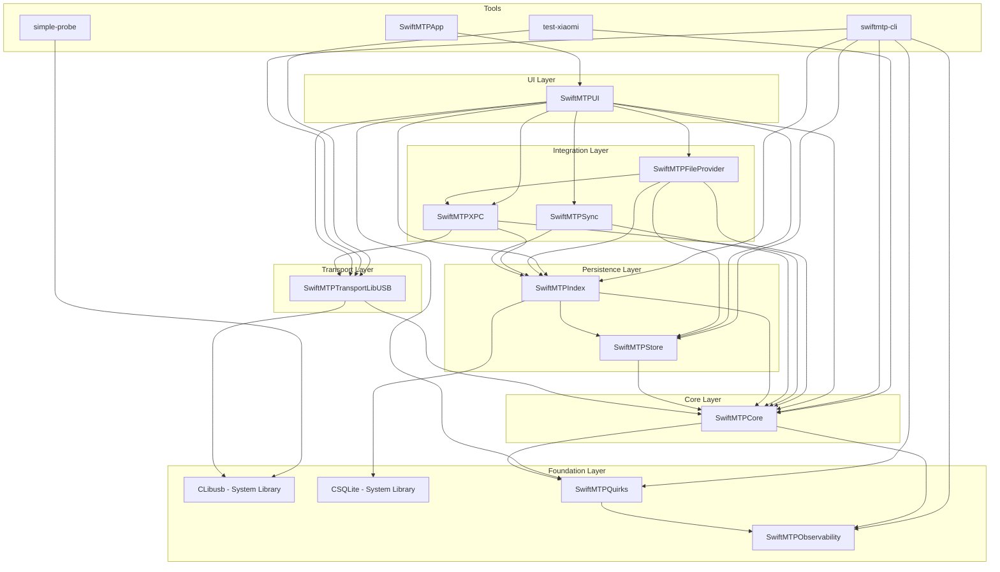

# SwiftMTP SRP Analysis - Module Graph and Extraction Seams

**Analysis Date:** 2026-02-23  
**Scope:** Reconnaissance for SRP micro-package extraction

---

## 1. Current Module Graph

### 1.1 Module Dependency Diagram



### 1.2 Module Summary Table

| Module | Lines (approx) | Primary Responsibility | Dependencies |
|--------|---------------|----------------------|--------------|
| SwiftMTPObservability | ~100 | Logging, throughput metrics | None |
| SwiftMTPQuirks | ~400 | Device quirks database, tuning flags | None |
| SwiftMTPCore | ~2,500 | MTP protocol, device abstraction, CLI types | Quirks, Observability |
| SwiftMTPTransportLibUSB | ~1,800 | USB transport, interface probing | Core, CLibusb |
| SwiftMTPStore | ~500 | SwiftData persistence | Core |
| SwiftMTPIndex | ~1,200 | SQLite index, caching, crawling | Core, Store, CSQLite |
| SwiftMTPSync | ~300 | Mirror engine | Core, Index |
| SwiftMTPXPC | ~400 | XPC service protocol | Core, Transport, Index |
| SwiftMTPFileProvider | ~400 | File Provider extension | Core, Index, Store, XPC |
| SwiftMTPUI | ~500 | SwiftUI views | All above |

---

## 2. Multi-Job Types and Modules

### 2.1 Critical: MTPDeviceActor (God Object)

**Location:** [`SwiftMTPKit/Sources/SwiftMTPCore/Internal/DeviceActor.swift`](SwiftMTPKit/Sources/SwiftMTPCore/Internal/DeviceActor.swift) + [`DeviceActor+Transfer.swift`](SwiftMTPKit/Sources/SwiftMTPCore/Internal/DeviceActor+Transfer.swift)

**Size:** ~75,000 characters combined

**Responsibilities Identified:**

| Responsibility | Description | Extraction Candidate |
|---------------|-------------|---------------------|
| Session Management | Opening/closing MTP sessions, stabilization | `MTPSessionManager` |
| Tuning Application | Loading quirks, learned profiles, building effective tuning | `TuningResolver` |
| Capability Probing | Testing partial read/write, events support | `CapabilityProber` |
| Transfer Operations | Read/write with progress, journaling, resume | `TransferEngine` |
| Storage Management | Listing storages, handling empty storage fallback | `StorageManager` |
| Event Handling | Event pump, event polling | `EventPump` |
| Quirk Resolution | Fingerprint building, quirk matching | Already in Quirks module |

**SRP Violation Evidence:**
- File has 550+ lines in main file, 1200+ lines in Transfer extension
- Contains 15+ distinct public methods
- Mixes protocol-level concerns with business logic
- Has internal helper structs that should be separate types

### 2.2 Major: LibUSBTransport (Multi-Responsibility)

**Location:** [`SwiftMTPKit/Sources/SwiftMTPTransportLibUSB/LibUSBTransport.swift`](SwiftMTPKit/Sources/SwiftMTPTransportLibUSB/LibUSBTransport.swift)

**Size:** ~56,000 characters

**Responsibilities Identified:**

| Responsibility | Description | Extraction Candidate |
|---------------|-------------|---------------------|
| Device Discovery | Enumerating MTP devices on USB bus | `USBDeviceDiscovery` |
| Interface Probing | Ranking interfaces, heuristic evaluation | Already in InterfaceProbe.swift |
| Transport Operations | Bulk transfers, control transfers | `USBTransport` |
| Mock Device Database | Simulated device responses | Already in MockDeviceDatabase.swift |

**Note:** Some extraction already done (InterfaceProbe, MockDeviceDatabase), but main transport file remains large.

### 2.3 Major: SQLiteLiveIndex (Multi-Responsibility)

**Location:** [`SwiftMTPKit/Sources/SwiftMTPIndex/LiveIndex/SQLiteLiveIndex.swift`](SwiftMTPKit/Sources/SwiftMTPIndex/LiveIndex/SQLiteLiveIndex.swift)

**Size:** ~32,000 characters

**Responsibilities Identified:**

| Responsibility | Description | Extraction Candidate |
|---------------|-------------|---------------------|
| Schema Management | Creating tables, migrations | `IndexSchema` |
| Object Indexing | CRUD for live objects | `ObjectIndex` |
| Storage Tracking | Storage metadata persistence | `StorageIndex` |
| Device Identity | Identity resolution and persistence | `IdentityIndex` |
| Crawl State | Tracking crawl progress | `CrawlStateIndex` |

### 2.4 Moderate: InterfaceProbe (Focused but Large)

**Location:** [`SwiftMTPKit/Sources/SwiftMTPTransportLibUSB/InterfaceProbe.swift`](SwiftMTPKit/Sources/SwiftMTPTransportLibUSB/InterfaceProbe.swift)

**Size:** ~46,000 characters

**Assessment:** Single responsibility (USB interface evaluation) but could benefit from internal decomposition:
- Heuristic evaluation functions
- Endpoint discovery
- Candidate ranking
- Probe attempt tracking

---

## 3. Repeated Helper Clusters

### 3.1 Little-Endian Encoding/Decoding

**Pattern:** Functions for encoding/decoding integers in little-endian format for MTP protocol.

**Locations Found:**
- [`SwiftMTPKit/Sources/SwiftMTPCore/Public/MTPDevice.swift:8-18`](SwiftMTPKit/Sources/SwiftMTPCore/Public/MTPDevice.swift:8) - `decodeLittleEndian<T>`
- [`SwiftMTPKit/Sources/SwiftMTPCore/Internal/Protocol/PTPCodec.swift:365-367`](SwiftMTPKit/Sources/SwiftMTPCore/Internal/Protocol/PTPCodec.swift:365) - `put32`, `put16`
- [`SwiftMTPKit/Sources/SwiftMTPTransportLibUSB/MockTransport.swift:128-132`](SwiftMTPKit/Sources/SwiftMTPTransportLibUSB/MockTransport.swift:128) - `p16`, `p32`, `p64`

**Extraction Candidate:** `MTPEndianCodec` utility module

```swift
// Proposed module: SwiftMTPCore/Internal/Protocol/EndianCodec.swift
public enum MTPEndianCodec {
    public static func decodeLittleEndian<T: FixedWidthInteger>(_ data: Data, at offset: Int) -> T?
    public static func encode<T: FixedWidthInteger>(_ value: T) -> Data
    public static func encode<T: FixedWidthInteger>(_ value: T, into buf: UnsafeMutablePointer<UInt8>) -> Int
}
```

### 3.2 NSLock-Based Thread-Safe Wrappers

**Pattern:** Multiple implementations of thread-safe wrappers using NSLock.

**Locations Found (15+ occurrences):**
- [`SwiftMTPKit/Sources/SwiftMTPCore/Public/FeatureFlags.swift`](SwiftMTPKit/Sources/SwiftMTPCore/Public/FeatureFlags.swift) - `MTPFeatureFlags`
- [`SwiftMTPKit/Sources/SwiftMTPCore/Internal/Transfer/TransferIO.swift`](SwiftMTPKit/Sources/SwiftMTPCore/Internal/Transfer/TransferIO.swift) - `FileSink`, `FileSource`
- [`SwiftMTPKit/Sources/SwiftMTPCore/Internal/Transfer/SendableAdapters.swift`](SwiftMTPKit/Sources/SwiftMTPCore/Internal/Transfer/SendableAdapters.swift) - `_Lock`
- [`SwiftMTPKit/Sources/SwiftMTPCore/Internal/DeviceActor+Transfer.swift`](SwiftMTPKit/Sources/SwiftMTPCore/Internal/DeviceActor+Transfer.swift) - `LockedDataBuffer`
- [`SwiftMTPKit/Sources/SwiftMTPTransportLibUSB/LibUSBTransport.swift`](SwiftMTPKit/Sources/SwiftMTPTransportLibUSB/LibUSBTransport.swift) - Data buffer
- [`SwiftMTPKit/Sources/SwiftMTPTestKit/`](SwiftMTPKit/Sources/SwiftMTPTestKit/) - Multiple test utilities

**Extraction Candidate:** `LockedValue<T>` generic wrapper

```swift
// Proposed module: SwiftMTPObservability or new SwiftMTPConcurrency module
public final class LockedValue<T>: @unchecked Sendable {
    private var _value: T
    private let lock = NSLock()
    
    public init(_ value: T) { self._value = value }
    
    public var value: T {
        get { lock.lock(); defer { lock.unlock() }; return _value }
        set { lock.lock(); defer { lock.unlock() }; _value = newValue }
    }
    
    public func withLock<R>(_ body: (inout T) throws -> R) rethrows -> R {
        lock.lock(); defer { lock.unlock() }
        return try body(&_value)
    }
}
```

### 3.3 PTPString Encoding/Decoding

**Pattern:** MTP/PTP Unicode string handling (count-prefixed UTF-16LE).

**Locations:**
- [`SwiftMTPKit/Sources/SwiftMTPCore/Internal/Protocol/PTPCodec.swift:75-120`](SwiftMTPKit/Sources/SwiftMTPCore/Internal/Protocol/PTPCodec.swift:75) - `PTPString.parse`, `PTPString.encode`

**Assessment:** Already centralized in PTPCodec, but could be extracted to standalone `PTPStringEncoding` type for clarity.

### 3.4 Progress Tracking

**Pattern:** Multiple implementations of progress tracking for transfers.

**Locations:**
- [`SwiftMTPKit/Sources/SwiftMTPCore/Internal/Protocol/Proto+Transfer.swift`](SwiftMTPKit/Sources/SwiftMTPCore/Internal/Protocol/Proto+Transfer.swift) - `AtomicCounter`
- [`SwiftMTPKit/Sources/SwiftMTPCore/Internal/DeviceActor+Transfer.swift`](SwiftMTPKit/Sources/SwiftMTPCore/Internal/DeviceActor+Transfer.swift) - `AtomicProgressTracker`

**Extraction Candidate:** Consolidate into single `TransferProgress` type.

---

## 4. Ranked SRP Extraction Candidates

### Ranking Criteria

Each candidate is evaluated on:
- **Tight Responsibility (TR):** Can it be clearly defined? (1-5)
- **High Reuse (HR):** Would other code benefit? (1-5)
- **Low UI Coupling (LUC):** Can it be extracted without UI deps? (1-5)
- **Clear Public Surface (CPS):** Is the API well-defined? (1-5)
- **Extraction Effort (EE):** Lower is easier (1-5, inverted)

**Score = TR + HR + LUC + CPS + (6-EE)** (Max: 25)

### 4.1 Ranked List

| Rank | Candidate | TR | HR | LUC | CPS | EE | Score | Justification |
|------|-----------|----|----|-----|-----|----|-------|---------------|
| 1 | **TransferEngine** | 5 | 5 | 5 | 5 | 2 | 23 | Clear boundary, high reuse, already partially separated in Transfer directory |
| 2 | **TuningResolver** | 5 | 4 | 5 | 5 | 3 | 21 | Pure logic, no I/O, clear inputs/outputs, testable |
| 3 | **MTPEndianCodec** | 5 | 5 | 5 | 5 | 4 | 21 | Small, pure utility, immediate reuse across modules |
| 4 | **CapabilityProber** | 4 | 4 | 5 | 4 | 3 | 20 | Well-defined scope, testable, no UI deps |
| 5 | **LockedValue Utility** | 5 | 5 | 5 | 5 | 5 | 20 | Simple, immediate reuse, reduces boilerplate |
| 6 | **MTPSessionManager** | 4 | 3 | 5 | 4 | 3 | 19 | Clear responsibility but entangled with tuning |
| 7 | **IndexSchema** | 5 | 3 | 5 | 4 | 4 | 18 | Clear responsibility, moderate effort |
| 8 | **USBDeviceDiscovery** | 4 | 4 | 5 | 3 | 4 | 17 | Useful but requires transport refactoring |
| 9 | **EventPump** | 4 | 3 | 5 | 3 | 4 | 16 | Currently stub, needs implementation first |
| 10 | **ObjectIndex** | 4 | 3 | 5 | 3 | 5 | 15 | Part of larger SQLiteLiveIndex extraction |

---

## 5. Recommended Extraction Sequence

### Phase 1: Foundation Utilities (Low Risk)

1. **MTPEndianCodec** - Extract little-endian utilities
   - Create `SwiftMTPCore/Internal/Protocol/EndianCodec.swift`
   - Update all call sites
   - No API changes

2. **LockedValue** - Add thread-safe wrapper
   - Add to `SwiftMTPObservability` or create `SwiftMTPConcurrency`
   - Gradually migrate existing NSLock patterns

### Phase 2: Protocol Layer (Medium Risk)

3. **TransferEngine** - Extract transfer logic from DeviceActor
   - Create `SwiftMTPCore/Internal/Transfer/TransferEngine.swift`
   - Move read/write methods and related types
   - DeviceActor delegates to TransferEngine

4. **TuningResolver** - Extract tuning resolution logic
   - Create `SwiftMTPCore/Internal/Tuning/TuningResolver.swift`
   - Move `applyTuningAndOpenSession` logic
   - Pure function with clear inputs/outputs

### Phase 3: Capability Layer (Medium Risk)

5. **CapabilityProber** - Extract capability probing
   - Create `SwiftMTPCore/Internal/CapabilityProber.swift`
   - Move `capabilityPartialRead`, `capabilityPartialWrite`, etc.

6. **MTPSessionManager** - Extract session management
   - Create `SwiftMTPCore/Internal/SessionManager.swift`
   - Move session open/close, stabilization

### Phase 4: Persistence Layer (Higher Risk)

7. **IndexSchema** - Extract schema management
   - Create `SwiftMTPIndex/Schema/` directory
   - Separate schema creation from CRUD operations

8. **ObjectIndex** - Extract object indexing
   - Create focused types for each index concern

---

## 6. Architectural Observations

### 6.1 Positive Patterns

1. **Protocol-based abstraction** - `MTPTransport`, `MTPLink`, `ByteSink` protocols enable testing and flexibility
2. **Actor isolation** - Consistent use of Swift actors for thread safety
3. **Separation of concerns** - Quirks, Observability already extracted as separate modules
4. **Test infrastructure** - SwiftMTPTestKit provides mock implementations

### 6.2 Areas for Improvement

1. **God Object** - `MTPDeviceActor` is doing too much; extract to focused components
2. **Utility duplication** - Little-endian encoding, lock patterns duplicated
3. **Mixed abstraction levels** - DeviceActor mixes protocol details with business logic
4. **Large files** - Several files exceed 30KB, indicating need for decomposition

### 6.3 Module Boundary Recommendations

```
SwiftMTPCore/
├── Public/           # Stable public API
├── Internal/
│   ├── Protocol/     # MTP/PTP protocol layer (codec, containers)
│   ├── Transport/    # Transport abstraction (protocols only)
│   ├── Transfer/     # Transfer engine (read/write logic)
│   ├── Session/      # Session management
│   ├── Tuning/       # Tuning resolution
│   └── Capability/   # Capability probing
```

---

## 7. Next Steps

1. **Review this analysis** with team for prioritization
2. **Create extraction tickets** for Phase 1 utilities
3. **Prototype TransferEngine extraction** to validate approach
4. **Update architecture documentation** after extractions

---

*Generated by SRP Analysis - SwiftMTP Reconnaissance Phase*
